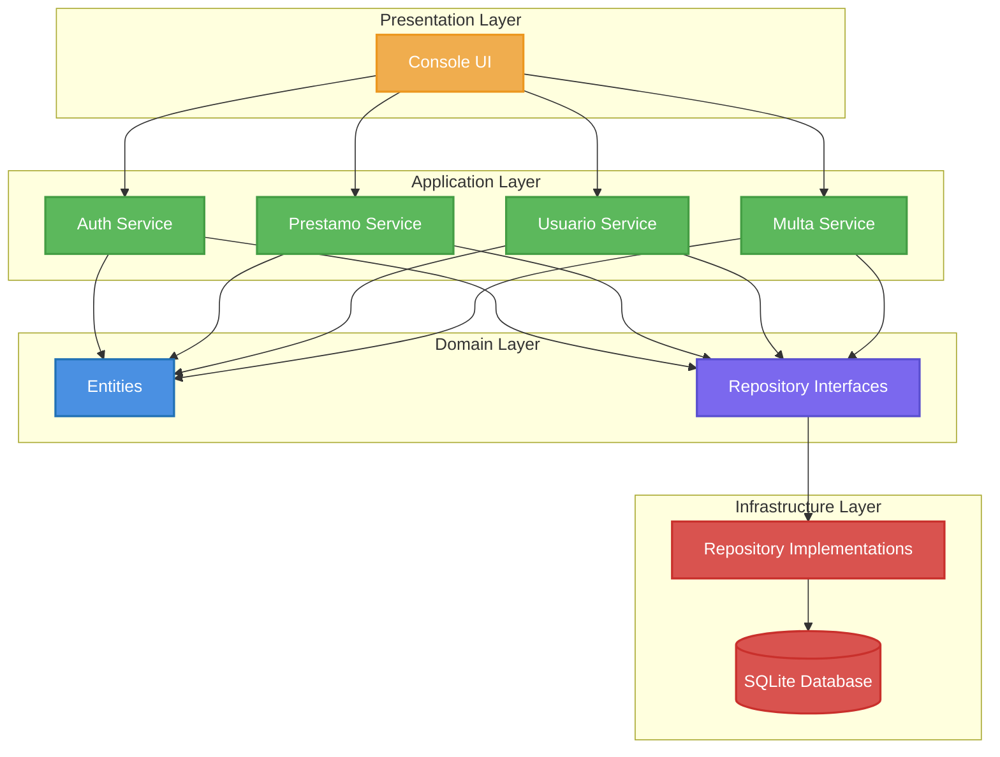

# Sistema de Gestión Bibliotecaria - Biblioteca Liskov

## 📖 Descripción General

Sistema de gestión bibliotecaria implementado siguiendo principios de **Clean Architecture** y patrones de diseño enterprise. El sistema demuestra la aplicación práctica de los principios SOLID, patrones de diseño GoF, y arquitectura hexagonal en un dominio de negocio real.

## 🚀 Características Principales

- 🏗️ **Arquitectura Hexagonal**: Separación clara entre dominio, aplicación e infraestructura
- 👥 **Gestión de Usuarios**: Alumnos, docentes y empleados con diferentes privilegios
- 📚 **Catálogo de Libros**: Gestión completa del inventario
- 🔄 **Sistema de Préstamos**: Control de préstamos y devoluciones
- 💰 **Gestión de Multas**: Cálculo automático y seguimiento
- 📅 **Sistema de Reservas**: Reserva de libros no disponibles
- 🧪 **Testing Completo**: Tests unitarios e integración

## 📚 Documentación

### 🏗️ [Arquitectura del Sistema](docs/ARCHITECTURE.md)
Descripción detallada de la arquitectura hexagonal, diagramas C4, y estructura de capas del sistema.

### 🎯 [Patrones de Diseño](docs/DESIGN_PATTERNS.md) 
Explicación exhaustiva de todos los patrones implementados: Repository, Service Layer, Unit of Work, y principios SOLID aplicados.

### ⚙️ [Guía de Instalación y Uso](docs/INSTALLATION.md)
Instrucciones paso a paso para instalar, configurar y ejecutar el sistema.

### 🧪 [Guía de Testing](docs/TESTING.md)
Documentación sobre la estrategia de testing, cómo ejecutar tests y escribir nuevos.

### 📋 [Casos de Uso](docs/USE_CASES.md)
Especificación completa de casos de uso por tipo de usuario, con flujos detallados y reglas de negocio.

## 🏛️ Arquitectura en Resumen



## 🚀 Inicio Rápido

### Prerrequisitos
- Python 3.11 o superior

### Instalación
```bash
# Clonar el repositorio
git clone https://github.com/Analisis-y-metodologia-de-sistemas/Biblioteca-Liskov.git
cd Biblioteca-Liskov

# Instalar dependencias
pip install -r requirements.txt

# Ejecutar el sistema
python main.py
```

## 📁 Estructura del Proyecto

```
Biblioteca_Liskov/
├── src/
│   ├── domain/              # 💎 Entidades y lógica de negocio
│   ├── application/         # 🧠 Servicios y casos de uso
│   ├── infrastructure/      # 🔧 Implementaciones técnicas
│   ├── presentation/        # 🎭 Interfaz de usuario
│   └── shared/              # 🔄 Componentes compartidos
├── tests/
│   ├── unit/               # Tests unitarios
│   └── integration/        # Tests de integración
├── docs/                   # 📖 Documentación detallada
├── data/                   # 🗄️ Base de datos
└── scripts/               # 🛠️ Scripts de utilidad
```

## 🛠️ Tecnologías

- **Python 3.11+**: Lenguaje principal
- **SQLite**: Base de datos  
- **Architecture**: Hexagonal (Ports & Adapters)
- **Testing**: unittest + pytest
- **Logging**: Python logging module

## 🤝 Contribuir

1. Fork del proyecto
2. Crear rama para feature (`git checkout -b feature/AmazingFeature`)
3. Commit de cambios (`git commit -m 'Add AmazingFeature'`)
4. Push a la rama (`git push origin feature/AmazingFeature`)
5. Abrir Pull Request

## 📄 Licencia

Este proyecto es parte del curso de Análisis y Metodología de Sistemas.

## 🔗 Enlaces Útiles

- **[Documentación Completa](docs/)**
- **[Arquitectura Detallada](docs/ARCHITECTURE.md)**
- **[Patrones de Diseño](docs/DESIGN_PATTERNS.md)**
- **[Casos de Uso](docs/USE_CASES.md)**
- **[Tests y Calidad](docs/TESTING.md)**

---

**Desarrollado como ejemplo práctico de aplicación de principios de Clean Architecture y patrones de diseño enterprise.**