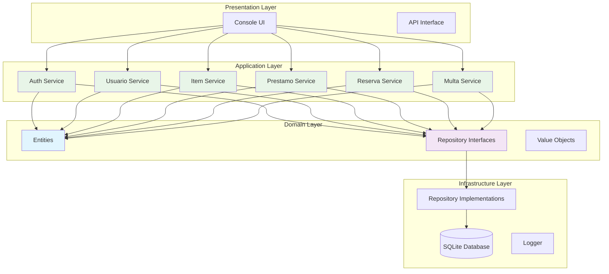
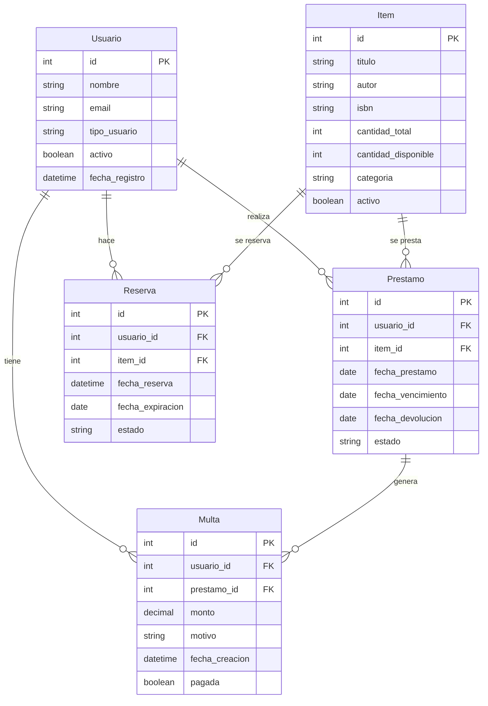
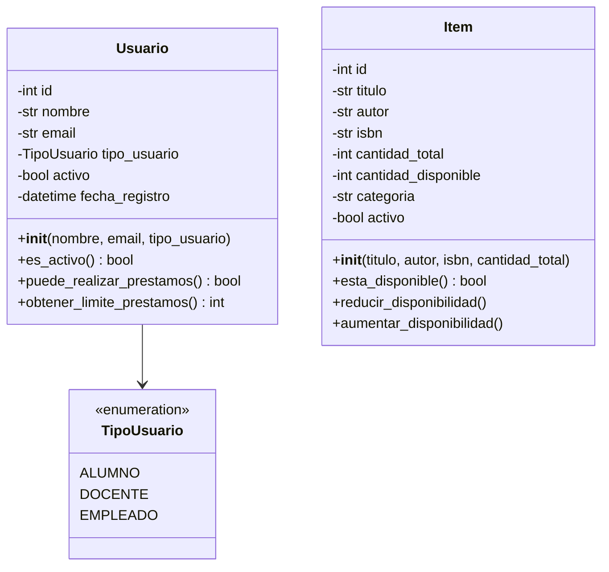
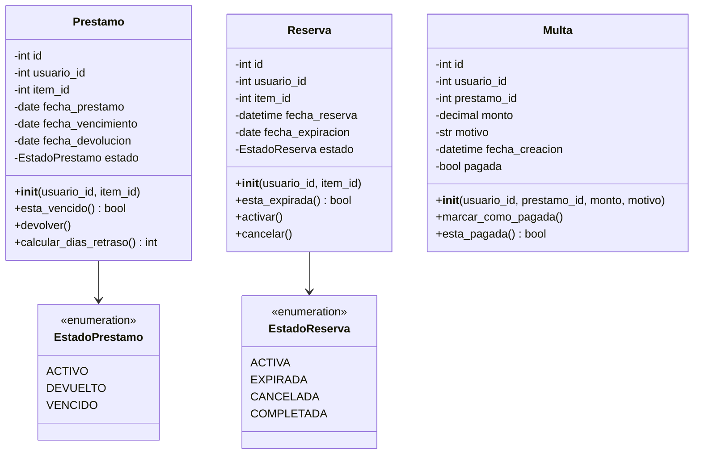
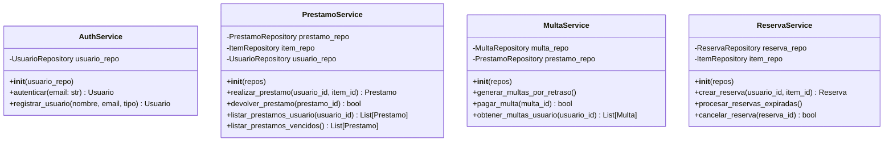

# Sistema de Gestión de Biblioteca - Arquitectura y Documentación

## Descripción General

Sistema de gestión bibliotecaria desarrollado con arquitectura hexagonal que permite la administración completa de una biblioteca universitaria. El sistema maneja usuarios (alumnos, docentes, empleados), préstamos, devoluciones, multas y reservas.

## Características Principales

- 🏗️ **Arquitectura Hexagonal**: Separación clara entre dominio, aplicación e infraestructura
- 👥 **Gestión de Usuarios**: Alumnos, docentes y empleados con diferentes privilegios
- 📚 **Catálogo de Libros**: Gestión completa del inventario
- 🔄 **Sistema de Préstamos**: Control de préstamos y devoluciones
- 💰 **Gestión de Multas**: Cálculo automático y seguimiento
- 📅 **Sistema de Reservas**: Reserva de libros no disponibles
- 🧪 **Testing Completo**: Tests unitarios e integración

## Arquitectura del Sistema

### Arquitectura Hexagonal (Ports & Adapters)



## Modelo de Datos

### Diagrama Entidad-Relación



## Diagramas de Clases por Módulos

### Módulo Domain - Entidades



### Módulo Domain - Operaciones



### Módulo Application - Servicios



## Diagramas de Secuencia

### Proceso de Préstamo

```mermaid
sequenceDiagram
    participant U as Usuario
    participant UI as Console UI
    participant PS as PrestamoService
    participant IR as ItemRepository
    participant PR as PrestamoRepository
    participant DB as Database
    
    U->>UI: Solicitar préstamo
    UI->>PS: realizar_prestamo(usuario_id, item_id)
    
    PS->>IR: obtener_por_id(item_id)
    IR->>DB: SELECT * FROM items WHERE id = ?
    DB-->>IR: item_data
    IR-->>PS: Item
    
    alt Item disponible
        PS->>PR: crear_prestamo(prestamo)
        PR->>DB: INSERT INTO prestamos
        DB-->>PR: prestamo_id
        
        PS->>IR: reducir_disponibilidad(item_id)
        IR->>DB: UPDATE items SET cantidad_disponible = ?
        
        PR-->>PS: Prestamo
        PS-->>UI: Prestamo exitoso
        UI-->>U: Confirmación de préstamo
    else Item no disponible
        PS-->>UI: Error - Item no disponible
        UI-->>U: Mensaje de error
    end
```



### Proceso de Devolución con Multa

```mermaid
sequenceDiagram
    participant U as Usuario
    participant UI as Console UI
    participant PS as PrestamoService
    participant MS as MultaService
    participant PR as PrestamoRepository
    participant MR as MultaRepository
    participant DB as Database
    
    U->>UI: Devolver libro
    UI->>PS: devolver_prestamo(prestamo_id)
    
    PS->>PR: obtener_por_id(prestamo_id)
    PR->>DB: SELECT * FROM prestamos WHERE id = ?
    DB-->>PR: prestamo_data
    PR-->>PS: Prestamo
    
    alt Préstamo vencido
        PS->>MS: generar_multa_por_retraso(prestamo)
        MS->>MR: crear_multa(multa)
        MR->>DB: INSERT INTO multas
        DB-->>MR: multa_id
        MR-->>MS: Multa
        MS-->>PS: Multa generada
    end
    
    PS->>PR: marcar_como_devuelto(prestamo_id)
    PR->>DB: UPDATE prestamos SET estado = 'DEVUELTO'
    
    PS-->>UI: Devolución completada
    UI-->>U: Confirmación (+ info de multa si aplica)
```



### Gestión de Reservas

```mermaid
sequenceDiagram
    participant U as Usuario
    participant UI as Console UI
    participant RS as ReservaService
    participant IR as ItemRepository
    participant RR as ReservaRepository
    participant DB as Database
    
    U->>UI: Reservar libro
    UI->>RS: crear_reserva(usuario_id, item_id)
    
    RS->>IR: obtener_por_id(item_id)
    IR->>DB: SELECT * FROM items WHERE id = ?
    DB-->>IR: item_data
    IR-->>RS: Item
    
    alt Item no disponible
        RS->>RR: crear_reserva(reserva)
        RR->>DB: INSERT INTO reservas
        DB-->>RR: reserva_id
        RR-->>RS: Reserva
        RS-->>UI: Reserva creada
        UI-->>U: Confirmación de reserva
    else Item disponible
        RS-->>UI: Item disponible para préstamo directo
        UI-->>U: Sugerir préstamo inmediato
    end
```



## Estructura del Proyecto

```
Biblioteca_Liskov/
├── src/
│   ├── domain/
│   │   ├── entities.py          # Entidades del dominio
│   │   └── repositories.py      # Interfaces de repositorios
│   ├── application/
│   │   ├── services.py          # Servicios de aplicación
│   │   ├── interfaces.py        # Interfaces de servicios
│   │   └── auth_service.py      # Servicio de autenticación
│   ├── infrastructure/
│   │   ├── database.py          # Configuración de base de datos
│   │   └── repositories.py      # Implementación de repositorios
│   ├── presentation/
│   │   └── console_ui.py        # Interfaz de consola
│   └── shared/
│       ├── config.py            # Configuración
│       ├── logger.py            # Sistema de logging
│       ├── exceptions.py        # Excepciones personalizadas
│       └── menu_utils.py        # Utilidades de menú
├── tests/
│   ├── unit/                    # Tests unitarios
│   └── integration/             # Tests de integración
├── data/
│   └── biblioteca.db            # Base de datos SQLite
├── docs/                        # Documentación adicional
├── scripts/                     # Scripts de utilidad
└── main.py                      # Punto de entrada
```

## Tecnologías Utilizadas

- **Python 3.11+**: Lenguaje principal
- **SQLite**: Base de datos
- **Architecture**: Hexagonal (Ports & Adapters)
- **Testing**: unittest (Python estándar)
- **Logging**: Python logging module

## Instalación y Ejecución

### Prerrequisitos
- Python 3.11 o superior

### Instalación

1. Clonar el repositorio:
```bash
git clone https://github.com/Analisis-y-metodologia-de-sistemas/Biblioteca-Liskov.git
cd Biblioteca-Liskov
```

2. Instalar dependencias:
```bash
pip install -r requirements.txt
```

3. Ejecutar el sistema:
```bash
python main.py
```

### Ejecutar Tests

```bash
# Tests unitarios
python -m pytest tests/unit/

# Tests de integración
python -m pytest tests/integration/

# Todos los tests
python -m pytest tests/
```

## Casos de Uso Principales

### 1. Gestión de Usuarios
- Registro de nuevos usuarios
- Autenticación de usuarios existentes
- Gestión de permisos por tipo de usuario

### 2. Gestión de Préstamos
- Realizar préstamo de libros
- Devolver libros prestados
- Consultar préstamos activos
- Renovar préstamos

### 3. Gestión de Multas
- Generación automática por retrasos
- Consulta de multas pendientes
- Pago de multas

### 4. Sistema de Reservas
- Reservar libros no disponibles
- Notificación cuando el libro esté disponible
- Cancelación de reservas

## Principios de Diseño Aplicados

### SOLID
- **S**: Cada servicio tiene una responsabilidad específica
- **O**: Las clases están abiertas para extensión, cerradas para modificación
- **L**: Las implementaciones son intercambiables por sus interfaces
- **I**: Interfaces específicas por dominio
- **D**: Dependencia de abstracciones, no de concreciones

### Arquitectura Hexagonal
- **Dominio**: Lógica de negocio pura
- **Aplicación**: Orquestación de casos de uso
- **Infraestructura**: Detalles técnicos
- **Presentation**: Interfaz de usuario

## Contribuir

1. Fork del proyecto
2. Crear rama para feature (`git checkout -b feature/AmazingFeature`)
3. Commit de cambios (`git commit -m 'Add AmazingFeature'`)
4. Push a la rama (`git push origin feature/AmazingFeature`)
5. Abrir Pull Request

## Licencia

Este proyecto es parte del curso de Análisis y Metodología de Sistemas.