# 🏗️ Arquitectura del Sistema - Biblioteca Liskov

## Índice

1. [Arquitectura Hexagonal](#arquitectura-hexagonal)
2. [Arquitectura C4](#arquitectura-c4)
3. [Modelo de Datos](#modelo-de-datos)
4. [Diagramas de Clases](#diagramas-de-clases)
5. [Diagramas de Secuencia](#diagramas-de-secuencia)
6. [Layered Architecture](#layered-architecture)

## Arquitectura Hexagonal

### Arquitectura Hexagonal (Ports & Adapters)

La arquitectura hexagonal permite que el dominio sea independiente de los detalles de infraestructura mediante el uso de puertos (interfaces) y adaptadores (implementaciones).

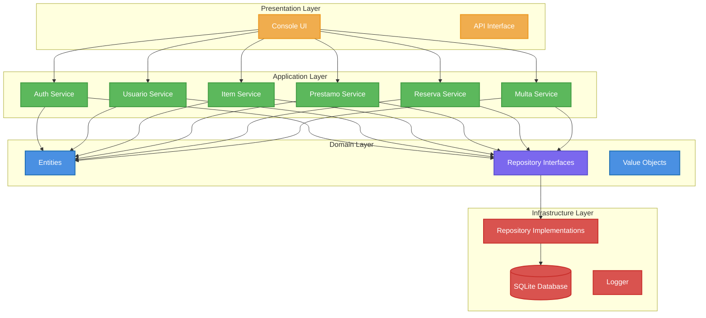

### Componentes Principales

- **Puertos (Interfaces)**: `src/domain/repositories.py` - Define contratos de acceso a datos
- **Adaptadores**: `src/infrastructure/repositories.py` - Implementaciones concretas
- **Núcleo**: `src/domain/entities.py` - Lógica de negocio pura

**Beneficio**: Permite intercambiar implementaciones (SQLite → PostgreSQL) sin afectar la lógica de negocio.

## Arquitectura C4

### Nivel 1: Contexto del Sistema

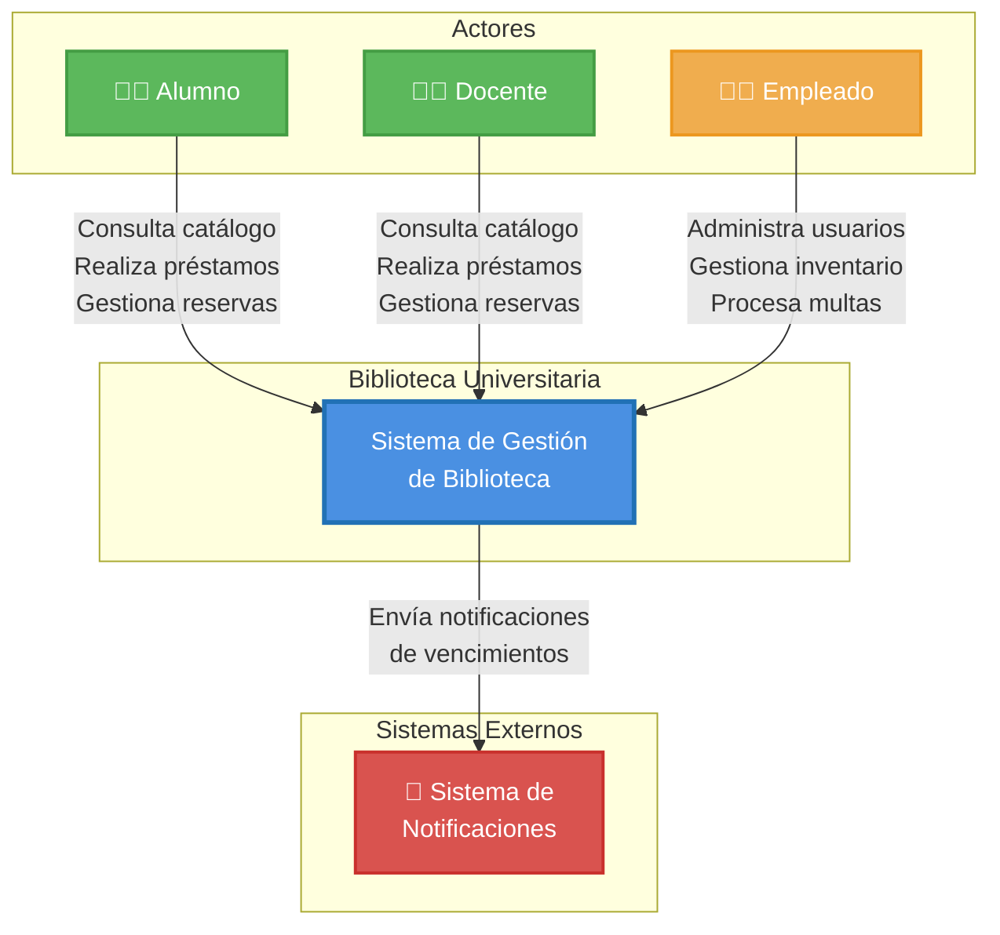

### Nivel 2: Contenedores

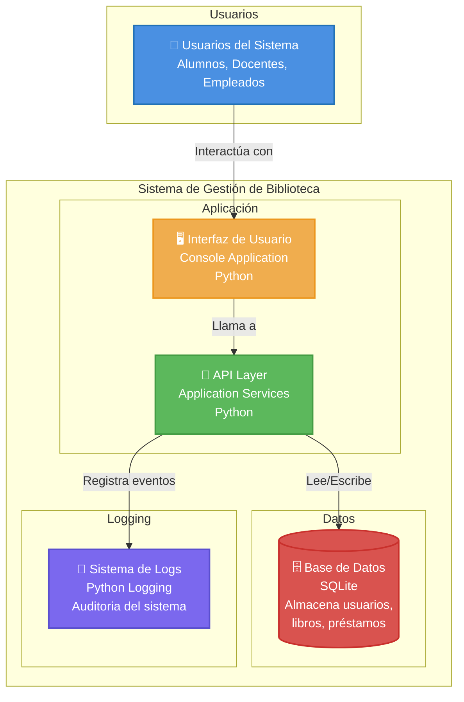

### Nivel 3: Componentes

```mermaid
graph TB
    subgraph "Presentation Layer"
        UI[Console UI]
        MU[Menu Utils]
    end
    
    subgraph "Application Layer"
        AS[Auth Service]
        PS[Prestamo Service]
        US[Usuario Service]
        IS[Item Service]
        RS[Reserva Service]
        MS[Multa Service]
    end
    
    subgraph "Domain Layer"
        subgraph "Entities"
            UE[Usuario]
            IE[Item]
            PE[Prestamo]
            RE[Reserva]
            ME[Multa]
        end
        
        subgraph "Repository Interfaces"
            URI[Usuario Repository<br/>Interface]
            IRI[Item Repository<br/>Interface]
            PRI[Prestamo Repository<br/>Interface]
            RRI[Reserva Repository<br/>Interface]
            MRI[Multa Repository<br/>Interface]
        end
    end
    
    subgraph "Infrastructure Layer"
        subgraph "Repository Implementations"
            UR[Usuario Repository]
            IR[Item Repository]
            PR[Prestamo Repository]
            RR[Reserva Repository]
            MR[Multa Repository]
        end
        
        subgraph "Data Access"
            DB[(SQLite Database)]
            DBC[Database Connection]
        end
    end
    
    subgraph "Shared"
        CFG[Configuration]
        LOG[Logger]
        EX[Exceptions]
    end
    
    UI --> AS
    UI --> PS
    UI --> US
    UI --> IS
    UI --> RS
    UI --> MS
    UI --> MU
    
    AS --> UE
    PS --> PE
    US --> UE
    IS --> IE
    RS --> RE
    MS --> ME
    
    AS --> URI
    PS --> PRI
    US --> URI
    IS --> IRI
    RS --> RRI
    MS --> MRI
    
    URI --> UR
    IRI --> IR
    PRI --> PR
    RRI --> RR
    MRI --> MR
    
    UR --> DBC
    IR --> DBC
    PR --> DBC
    RR --> DBC
    MR --> DBC
    
    DBC --> DB
    
    AS --> LOG
    PS --> LOG
    US --> LOG
    IS --> LOG
    RS --> LOG
    MS --> LOG
    
    AS --> CFG
    PS --> CFG
    US --> CFG
    IS --> CFG
    RS --> CFG
    MS --> CFG
    
    style UE fill:#4a90e2,stroke:#2171b5,stroke-width:2px,color:#fff
    style IE fill:#4a90e2,stroke:#2171b5,stroke-width:2px,color:#fff
    style PE fill:#4a90e2,stroke:#2171b5,stroke-width:2px,color:#fff
    style RE fill:#4a90e2,stroke:#2171b5,stroke-width:2px,color:#fff
    style ME fill:#4a90e2,stroke:#2171b5,stroke-width:2px,color:#fff
    style URI fill:#7b68ee,stroke:#5a4fcf,stroke-width:2px,color:#fff
    style IRI fill:#7b68ee,stroke:#5a4fcf,stroke-width:2px,color:#fff
    style PRI fill:#7b68ee,stroke:#5a4fcf,stroke-width:2px,color:#fff
    style RRI fill:#7b68ee,stroke:#5a4fcf,stroke-width:2px,color:#fff
    style MRI fill:#7b68ee,stroke:#5a4fcf,stroke-width:2px,color:#fff
    style AS fill:#5cb85c,stroke:#449d44,stroke-width:2px,color:#fff
    style PS fill:#5cb85c,stroke:#449d44,stroke-width:2px,color:#fff
    style US fill:#5cb85c,stroke:#449d44,stroke-width:2px,color:#fff
    style IS fill:#5cb85c,stroke:#449d44,stroke-width:2px,color:#fff
    style RS fill:#5cb85c,stroke:#449d44,stroke-width:2px,color:#fff
    style MS fill:#5cb85c,stroke:#449d44,stroke-width:2px,color:#fff
    style UI fill:#f0ad4e,stroke:#ec971f,stroke-width:2px,color:#fff
    style MU fill:#f0ad4e,stroke:#ec971f,stroke-width:2px,color:#fff
    style DB fill:#d9534f,stroke:#c9302c,stroke-width:2px,color:#fff
    style DBC fill:#d9534f,stroke:#c9302c,stroke-width:2px,color:#fff
    style UR fill:#d9534f,stroke:#c9302c,stroke-width:2px,color:#fff
    style IR fill:#d9534f,stroke:#c9302c,stroke-width:2px,color:#fff
    style PR fill:#d9534f,stroke:#c9302c,stroke-width:2px,color:#fff
    style RR fill:#d9534f,stroke:#c9302c,stroke-width:2px,color:#fff
    style MR fill:#d9534f,stroke:#c9302c,stroke-width:2px,color:#fff
```

## Modelo de Datos

### Diagrama Entidad-Relación

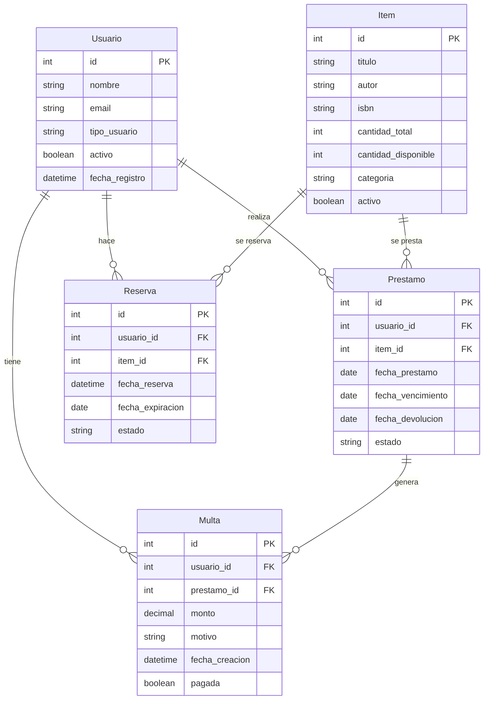

## Diagramas de Clases

### Módulo Domain - Entidades

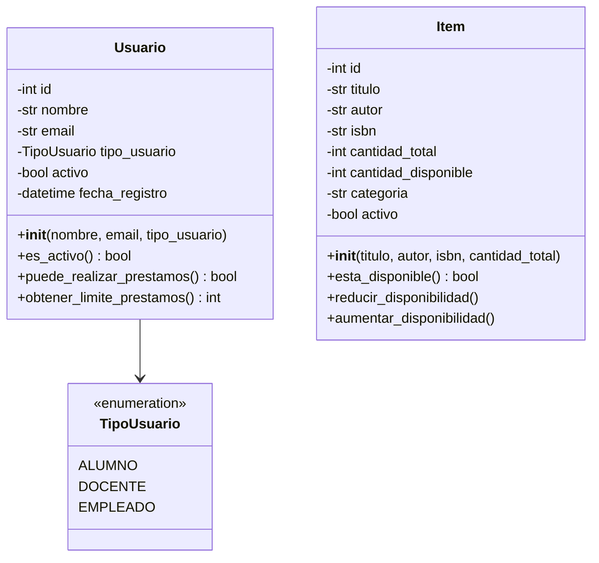

### Módulo Domain - Operaciones

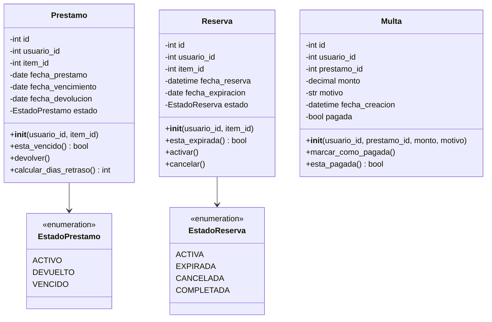

### Módulo Application - Servicios

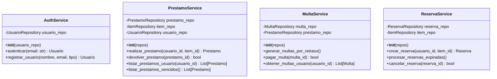

## Diagramas de Secuencia

### Proceso de Préstamo

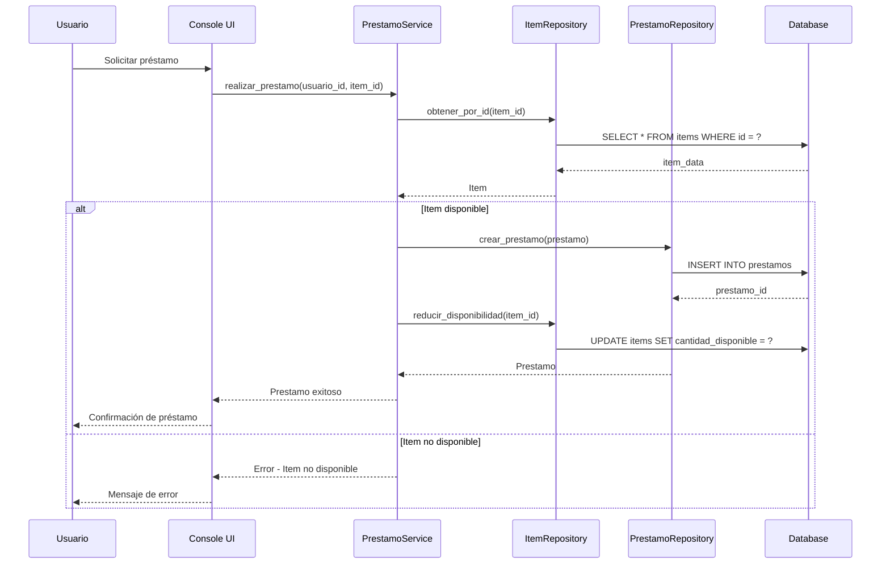

### Proceso de Devolución con Multa

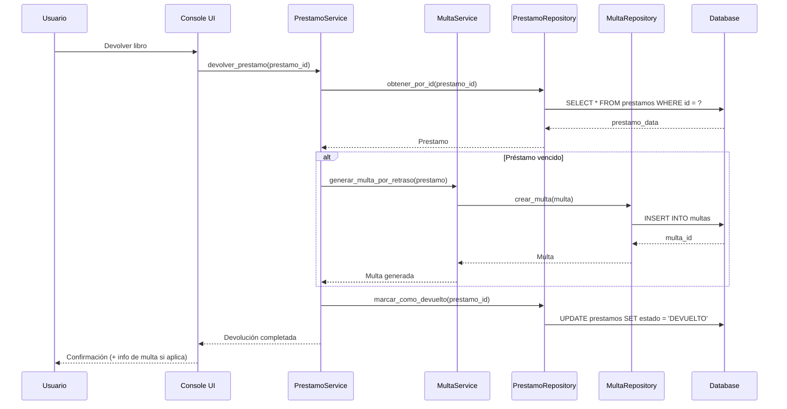

### Gestión de Reservas

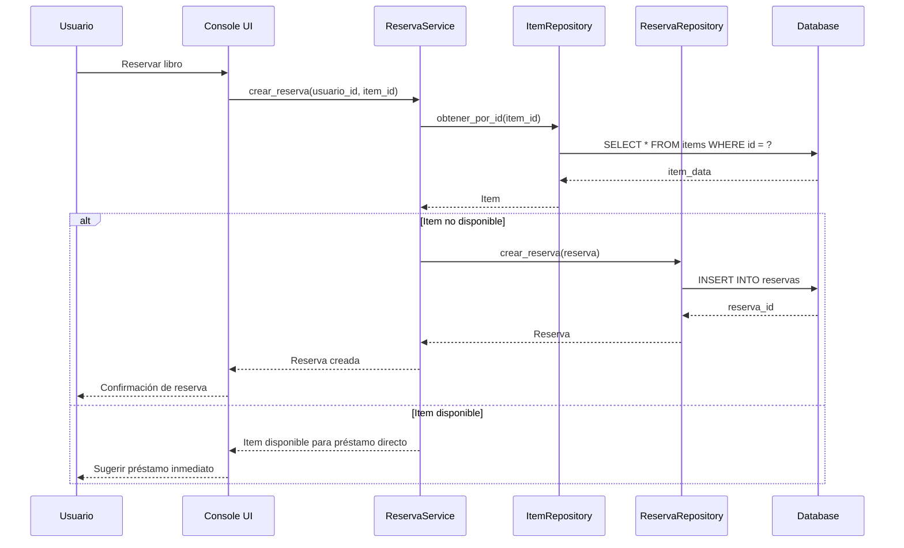

## Layered Architecture

### Flujo de Dependencias (Dependency Rule):

```
🎭 Presentation Layer
    ↓ (depende de)
🧠 Application Layer  
    ↓ (depende de)
💎 Domain Layer
    ↑ (implementa interfaces de)
🔧 Infrastructure Layer
```

**Regla fundamental**: Las dependencias apuntan hacia adentro. El Domain Layer no conoce nada sobre capas exteriores.

### Beneficios de la Arquitectura

- **Presentation Independence**: Cambiar UI sin afectar lógica de negocio
- **Database Independence**: Migrar BD solo requiere nueva implementación de Repository
- **Framework Independence**: No dependencia de frameworks específicos en el core
- **Testability**: Cada capa se puede probar independientemente

---

**[⬅️ Volver al README principal](../README.md)**