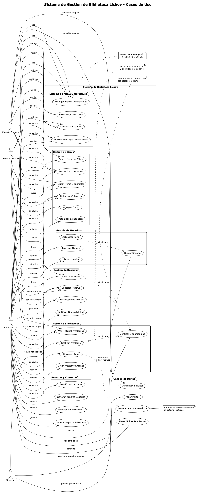
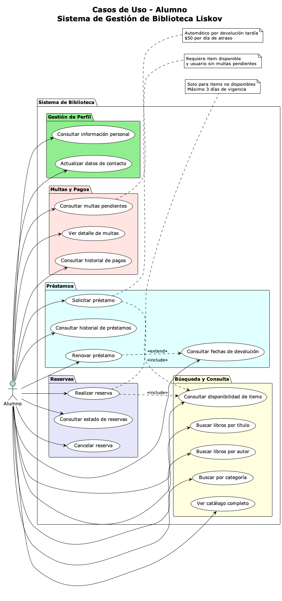
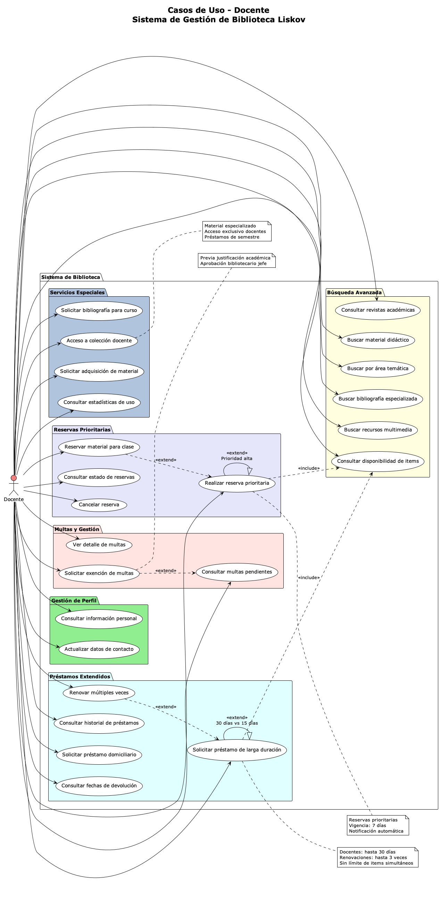
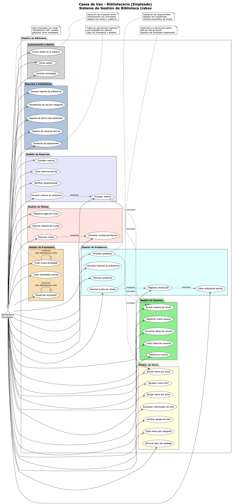

# 📋 Casos de Uso - Sistema de Biblioteca Liskov

## Índice

1. [Introducción](#introducción)
2. [Actores del Sistema](#actores-del-sistema)
3. [Casos de Uso por Actor](#casos-de-uso-por-actor)
4. [Casos de Uso Detallados](#casos-de-uso-detallados)
5. [Diagramas de Casos de Uso](#diagramas-de-casos-de-uso)

## Introducción

El Sistema de Gestión de Biblioteca Liskov está diseñado para atender las necesidades de diferentes tipos de usuarios mediante casos de uso específicos y bien definidos. Este documento describe todos los casos de uso del sistema, organizados por actor y detallando las funcionalidades disponibles para cada tipo de usuario.

## Actores del Sistema

### 👨‍🎓 **Alumno**
- **Descripción**: Estudiante de la universidad con acceso básico al sistema
- **Privilegios**: Consulta, préstamos limitados, reservas
- **Restricciones**: Máximo 3 préstamos simultáneos, 14 días de duración

### 👨‍🏫 **Docente**  
- **Descripción**: Profesor universitario con privilegios extendidos
- **Privilegios**: Préstamos extendidos, reservas prioritarias, acceso a colecciones especiales
- **Restricciones**: Máximo 5 préstamos, 30 días de duración

### 👩‍💼 **Bibliotecario (Empleado)**
- **Descripción**: Personal administrativo con permisos completos del sistema
- **Privilegios**: Gestión total del sistema, reportes, administración
- **Restricciones**: Requiere autenticación de empleado

### 🤖 **Sistema**
- **Descripción**: Procesos automáticos del sistema
- **Funciones**: Notificaciones, generación automática de multas, verificaciones

## Casos de Uso por Actor

### 📚 Casos de Uso - Alumno

#### **Gestión de Perfil**
- **UC-ALU-01**: Consultar información personal
- **UC-ALU-02**: Actualizar datos de contacto

#### **Búsqueda y Consulta**
- **UC-ALU-03**: Buscar libros por título
- **UC-ALU-04**: Buscar libros por autor  
- **UC-ALU-05**: Buscar por categoría
- **UC-ALU-06**: Consultar disponibilidad de items
- **UC-ALU-07**: Ver catálogo completo

#### **Préstamos**
- **UC-ALU-08**: Solicitar préstamo
- **UC-ALU-09**: Consultar historial de préstamos
- **UC-ALU-10**: Consultar fechas de devolución
- **UC-ALU-11**: Renovar préstamo

#### **Reservas**
- **UC-ALU-12**: Realizar reserva
- **UC-ALU-13**: Consultar estado de reservas
- **UC-ALU-14**: Cancelar reserva

#### **Multas y Pagos**
- **UC-ALU-15**: Consultar multas pendientes
- **UC-ALU-16**: Ver detalle de multas
- **UC-ALU-17**: Consultar historial de pagos

### 🎓 Casos de Uso - Docente

#### **Gestión de Perfil**
- **UC-DOC-01**: Consultar información personal
- **UC-DOC-02**: Actualizar datos de contacto

#### **Búsqueda Avanzada**
- **UC-DOC-03**: Buscar material didáctico
- **UC-DOC-04**: Buscar por área temática
- **UC-DOC-05**: Buscar bibliografía especializada
- **UC-DOC-06**: Consultar disponibilidad de items
- **UC-DOC-07**: Buscar recursos multimedia
- **UC-DOC-08**: Consultar revistas académicas

#### **Préstamos Extendidos**
- **UC-DOC-09**: Solicitar préstamo de larga duración
- **UC-DOC-10**: Renovar múltiples veces
- **UC-DOC-11**: Consultar historial de préstamos
- **UC-DOC-12**: Solicitar préstamo domiciliario
- **UC-DOC-13**: Consultar fechas de devolución

#### **Reservas Prioritarias**
- **UC-DOC-14**: Realizar reserva prioritaria
- **UC-DOC-15**: Reservar material para clase
- **UC-DOC-16**: Consultar estado de reservas
- **UC-DOC-17**: Cancelar reserva

#### **Servicios Especiales**
- **UC-DOC-18**: Solicitar bibliografía para curso
- **UC-DOC-19**: Acceso a colección docente
- **UC-DOC-20**: Solicitar adquisición de material
- **UC-DOC-21**: Consultar estadísticas de uso

#### **Multas y Gestión**
- **UC-DOC-22**: Consultar multas pendientes
- **UC-DOC-23**: Ver detalle de multas
- **UC-DOC-24**: Solicitar exención de multas

### 👩‍💼 Casos de Uso - Bibliotecario

#### **Autenticación y Sesión**
- **UC-BIB-01**: Iniciar sesión en el sistema
- **UC-BIB-02**: Cerrar sesión
- **UC-BIB-03**: Cambiar contraseña

#### **Gestión de Usuarios**
- **UC-BIB-04**: Registrar nuevo usuario
- **UC-BIB-05**: Buscar usuario por email
- **UC-BIB-06**: Actualizar datos de usuario
- **UC-BIB-07**: Listar todos los usuarios
- **UC-BIB-08**: Desactivar usuario

#### **Gestión de Items**
- **UC-BIB-09**: Agregar nuevo item
- **UC-BIB-10**: Buscar items por título
- **UC-BIB-11**: Buscar items por autor
- **UC-BIB-12**: Actualizar información de item
- **UC-BIB-13**: Cambiar estado de item
- **UC-BIB-14**: Listar items por categoría
- **UC-BIB-15**: Eliminar item del catálogo

#### **Gestión de Préstamos**
- **UC-BIB-16**: Procesar préstamo
- **UC-BIB-17**: Registrar devolución
- **UC-BIB-18**: Listar préstamos activos
- **UC-BIB-19**: Consultar historial de préstamos
- **UC-BIB-20**: Renovar préstamo
- **UC-BIB-21**: Generar multa por atraso

#### **Gestión de Reservas**
- **UC-BIB-22**: Procesar reserva
- **UC-BIB-23**: Cancelar reserva
- **UC-BIB-24**: Listar reservas activas
- **UC-BIB-25**: Notificar disponibilidad
- **UC-BIB-26**: Convertir reserva en préstamo

#### **Gestión de Multas**
- **UC-BIB-27**: Registrar pago de multa
- **UC-BIB-28**: Consultar multas pendientes
- **UC-BIB-29**: Generar reporte de multas
- **UC-BIB-30**: Exonerar multa

#### **Reportes y Estadísticas**
- **UC-BIB-31**: Generar reporte de préstamos
- **UC-BIB-32**: Estadísticas de uso por categoría
- **UC-BIB-33**: Reporte de items más solicitados
- **UC-BIB-34**: Reporte de usuarios activos
- **UC-BIB-35**: Auditoría de operaciones

#### **Gestión de Empleados**
- **UC-BIB-36**: Crear nuevo empleado *(Solo Bibliotecario Jefe)*
- **UC-BIB-37**: Listar empleados activos
- **UC-BIB-38**: Desactivar empleado *(Solo Bibliotecario Jefe)*

## Casos de Uso Detallados

### UC-ALU-08: Solicitar Préstamo

**Actor Principal**: Alumno  
**Precondiciones**: 
- Usuario autenticado
- No tener multas pendientes  
- No exceder límite de préstamos (3)

**Flujo Principal**:
1. Alumno selecciona item del catálogo
2. Sistema verifica disponibilidad del item
3. Sistema verifica límites del usuario
4. Sistema verifica que usuario no tenga multas pendientes
5. Sistema registra el préstamo
6. Sistema actualiza disponibilidad del item
7. Sistema confirma préstamo exitoso

**Flujos Alternativos**:
- **3a**: Item no disponible
  - Sistema ofrece opción de reserva
  - Continúa con UC-ALU-12
- **4a**: Usuario excede límite
  - Sistema muestra mensaje de error
  - Caso de uso termina
- **5a**: Usuario tiene multas pendientes
  - Sistema muestra multas pendientes
  - Caso de uso termina

**Postcondiciones**:
- Préstamo registrado en el sistema
- Item marcado como no disponible
- Fecha de devolución calculada (14 días)

---

### UC-DOC-09: Solicitar Préstamo de Larga Duración

**Actor Principal**: Docente  
**Precondiciones**:
- Usuario autenticado como docente
- Item disponible

**Flujo Principal**:
1. Docente selecciona item del catálogo
2. Sistema verifica disponibilidad del item
3. Sistema verifica privilegios de docente
4. Sistema registra préstamo con duración extendida
5. Sistema actualiza disponibilidad del item
6. Sistema confirma préstamo exitoso

**Características Especiales**:
- **Duración**: 30 días (vs 14 días para alumnos)
- **Renovaciones**: Hasta 3 veces
- **Límite**: 5 items simultáneos
- **Prioridad**: Alta en lista de espera

**Postcondiciones**:
- Préstamo registrado con fecha de devolución a 30 días
- Item reservado para uso docente

---

### UC-BIB-16: Procesar Préstamo

**Actor Principal**: Bibliotecario  
**Precondiciones**:
- Bibliotecario autenticado
- Usuario y item válidos

**Flujo Principal**:
1. Bibliotecario busca usuario por email/ID
2. Sistema muestra información del usuario
3. Bibliotecario busca item por título/código
4. Sistema muestra disponibilidad del item
5. Sistema verifica restricciones del usuario
6. Bibliotecario confirma el préstamo
7. Sistema registra préstamo con trazabilidad
8. Sistema actualiza inventario
9. Sistema genera recibo/comprobante

**Flujos de Excepción**:
- **Usuario con multas**: Sistema alerta, bibliotecario puede autorizar
- **Item dañado**: Bibliotecario puede cambiar estado antes de préstamo
- **Usuario suspendido**: Sistema bloquea, requiere autorización superior

**Postcondiciones**:
- Préstamo registrado con ID del bibliotecario responsable
- Trazabilidad completa de la operación
- Auditoría registrada

---

### UC-SYS-01: Generar Multa Automática

**Actor Principal**: Sistema  
**Trigger**: Devolución después de fecha límite

**Flujo Principal**:
1. Sistema detecta devolución tardía
2. Sistema calcula días de retraso  
3. Sistema calcula monto de multa ($50 por día)
4. Sistema genera registro de multa
5. Sistema asocia multa al préstamo y usuario
6. Sistema registra fecha y hora de generación
7. Sistema marca usuario con restricciones
8. Sistema envía notificación (opcional)

**Reglas de Negocio**:
- **Tarifa**: $50 pesos por día de retraso
- **Cálculo**: Solo días hábiles (opcional)
- **Límite**: Después de 3 multas, suspensión automática
- **Notificación**: Email/SMS al usuario

**Postcondiciones**:
- Multa registrada en el sistema
- Usuario restringido para nuevos préstamos
- Auditoría de la multa generada

## Relaciones Entre Casos de Uso

### **Include** (Incluye)
- **UC-ALU-08** → **UC-ALU-06**: Solicitar préstamo incluye verificar disponibilidad
- **UC-ALU-12** → **UC-ALU-06**: Realizar reserva incluye verificar disponibilidad
- **UC-BIB-16** → **UC-BIB-05**: Procesar préstamo incluye buscar usuario
- **UC-BIB-16** → **UC-BIB-10**: Procesar préstamo incluye buscar item

### **Extend** (Extiende)
- **UC-ALU-11** → **UC-ALU-10**: Renovar préstamo extiende consultar fechas
- **UC-BIB-21** → **UC-BIB-17**: Generar multa extiende registrar devolución (si hay retraso)
- **UC-DOC-24** → **UC-DOC-22**: Solicitar exención extiende consultar multas

### **Specialization** (Especialización)
- **UC-DOC-09** especializa **UC-ALU-08**: Préstamos docentes vs alumnos
- **UC-DOC-14** especializa **UC-ALU-12**: Reservas prioritarias vs normales

## Reglas de Negocio por Caso de Uso

### **Préstamos**
- **Alumnos**: 3 items, 14 días, 1 renovación
- **Docentes**: 5 items, 30 días, 3 renovaciones  
- **Empleados**: 10 items, 60 días, renovaciones ilimitadas

### **Reservas**
- **Duración**: 3 días para alumnos, 7 días para docentes
- **Cola**: FIFO con prioridad para docentes
- **Notificación**: Automática cuando item está disponible

### **Multas**
- **Tarifa**: $50 por día de retraso
- **Suspensión**: Automática después de 3 multas
- **Exención**: Solo docentes pueden solicitar, requiere aprobación

### **Restricciones de Acceso**
- **Material didáctico**: Solo docentes
- **Colección especial**: Solo empleados y docentes
- **Revistas**: Consulta in-situ para alumnos, préstamo para docentes

## Diagramas de Casos de Uso

### 🎯 Vista General del Sistema

El siguiente diagrama muestra una vista completa de todos los casos de uso del sistema, organizados por paquetes funcionales y mostrando las relaciones entre los diferentes actores (Alumno, Docente, Bibliotecario y Sistema). Este diagrama presenta la arquitectura funcional completa del Sistema de Biblioteca Liskov, incluyendo las dependencias y extensiones entre casos de uso.



**Explicación del diagrama**: Este diagrama presenta la vista completa del sistema organizada en 7 paquetes principales: Gestión de Usuarios, Gestión de Items, Gestión de Préstamos, Gestión de Reservas, Gestión de Multas, Reportes y Consultas, y Sistema de Menús Interactivos. Cada actor tiene diferentes niveles de acceso, donde el Bibliotecario tiene privilegios administrativos completos, el Docente tiene funcionalidades extendidas, y el Alumno tiene acceso básico. El Sistema actor representa las funciones automáticas como generación de multas y notificaciones.

---

### 👨‍🎓 Casos de Uso - Alumno

Este diagrama detalla específicamente las funcionalidades disponibles para los usuarios tipo Alumno. Los casos de uso están organizados en 5 áreas principales que cubren todas las necesidades básicas de un estudiante en el sistema bibliotecario.



**Explicación del diagrama**: Los casos de uso del alumno están agrupados por colores según su funcionalidad:
- **Verde claro** (Gestión de Perfil): Funciones básicas de usuario para mantener información personal actualizada
- **Amarillo claro** (Búsqueda y Consulta): Herramientas de búsqueda y consulta del catálogo, esenciales para localizar material bibliográfico
- **Cian claro** (Préstamos): Operaciones relacionadas con préstamos, desde solicitud hasta renovación
- **Lavanda** (Reservas): Sistema de reservas para material no disponible
- **Rosa claro** (Multas y Pagos): Consulta y gestión de multas pendientes

Las relaciones "include" muestran que tanto solicitar préstamo como realizar reserva requieren verificar disponibilidad de items, mientras que la relación "extend" indica que renovar préstamo es una extensión opcional de consultar fechas de devolución.

---

### 👨‍🏫 Casos de Uso - Docente

El diagrama para docentes muestra funcionalidades extendidas y privilegios especiales que reflejan las necesidades académicas e institucionales de los profesores universitarios.



**Explicación del diagrama**: Los docentes tienen acceso a funcionalidades especializadas organizadas en 6 categorías:
- **Verde claro** (Gestión de Perfil): Similar a alumnos pero con opciones adicionales
- **Amarillo claro** (Búsqueda Avanzada): Búsquedas especializadas para material didáctico, bibliografía especializada y recursos multimedia
- **Cian claro** (Préstamos Extendidos): Préstamos de larga duración (30 días vs 14), múltiples renovaciones y préstamos domiciliarios
- **Lavanda** (Reservas Prioritarias): Sistema de reservas con prioridad alta y reservas para uso en clase
- **Azul claro** (Servicios Especiales): Acceso a colección docente exclusiva y solicitudes de adquisición de material
- **Rosa claro** (Multas y Gestión): Incluye la posibilidad de solicitar exención de multas con justificación académica

Las especializaciones muestran que los préstamos docentes tienen 30 días vs 15 días estándar, y las reservas tienen prioridad alta en el sistema.

---

### 👩‍💼 Casos de Uso - Bibliotecario (Empleado)

Este diagrama presenta el conjunto más completo de funcionalidades, ya que los bibliotecarios son los administradores del sistema con acceso total a todas las operaciones administrativas y de gestión.



**Explicación del diagrama**: Los casos de uso del bibliotecario abarcan 8 áreas funcionales principales:
- **Gris claro** (Autenticación y Sesión): Gestión segura de sesiones con trazabilidad
- **Verde claro** (Gestión de Usuarios): CRUD completo de usuarios con capacidades de búsqueda y administración
- **Amarillo claro** (Gestión de Items): Administración completa del catálogo bibliotecario
- **Cian claro** (Gestión de Préstamos): Procesamiento de préstamos con validaciones y generación automática de multas
- **Lavanda** (Gestión de Reservas): Administración del sistema de reservas y notificaciones
- **Rosa claro** (Gestión de Multas): Control completo de multas incluyendo exoneraciones
- **Azul acero** (Reportes y Estadísticas): Generación de reportes gerenciales y auditorías
- **Trigo** (Gestión de Empleados): Funciones administrativas restringidas al Bibliotecario Jefe

Las relaciones "include" muestran dependencias funcionales (procesar préstamo requiere buscar usuario e item), mientras que las relaciones "extend" indican funcionalidades condicionales (generar multa se ejecuta solo si hay atraso en devolución).

**Restricciones de acceso**: Algunos casos de uso (UC36, UC38) están marcados con restricciones especiales, indicando que solo el Bibliotecario Jefe puede ejecutar funciones de gestión de empleados.

## Trazabilidad

### **Casos de Uso → Requisitos Funcionales**
- **RF-001**: Gestión de usuarios → UC-BIB-04 a UC-BIB-08
- **RF-002**: Gestión de préstamos → UC-ALU-08, UC-DOC-09, UC-BIB-16
- **RF-003**: Sistema de multas → UC-SYS-01, UC-BIB-21, UC-BIB-27
- **RF-004**: Reportes y estadísticas → UC-BIB-31 a UC-BIB-35

### **Casos de Uso → Clases del Dominio**
- **Usuario**: UC-ALU-01, UC-DOC-01, UC-BIB-04 a UC-BIB-08
- **Item**: UC-ALU-06, UC-BIB-09 a UC-BIB-15
- **Prestamo**: UC-ALU-08, UC-DOC-09, UC-BIB-16 a UC-BIB-21
- **Reserva**: UC-ALU-12, UC-DOC-14, UC-BIB-22 a UC-BIB-26
- **Multa**: UC-ALU-15, UC-SYS-01, UC-BIB-27 a UC-BIB-30

## Código Fuente de Diagramas

Los diagramas mostrados anteriormente fueron generados a partir de código PlantUML, que permite una especificación textual clara y mantenible de los casos de uso. Los archivos fuente están disponibles en:

### 📄 **Archivos PlantUML**
- **[casos-de-uso.puml](casos-de-uso.puml)**: Código fuente del diagrama general completo
- **[casos-uso-alumno.puml](casos-uso-alumno.puml)**: Especificación de casos de uso para alumnos
- **[casos-uso-docente.puml](casos-uso-docente.puml)**: Especificación de casos de uso para docentes
- **[casos-uso-bibliotecario.puml](casos-uso-bibliotecario.puml)**: Especificación de casos de uso administrativos

### 🔧 **Regenerar Diagramas**

Para regenerar los diagramas PNG a partir de los archivos PlantUML:

```bash
# Instalar PlantUML
brew install plantuml
# o
npm install -g node-plantuml

# Generar diagramas
plantuml docs/casos-de-uso.puml
plantuml docs/casos-uso-alumno.puml
plantuml docs/casos-uso-docente.puml
plantuml docs/casos-uso-bibliotecario.puml
```

Los archivos PlantUML utilizan una sintaxis declarativa que facilita:
- **Mantenimiento**: Cambios textuales simples
- **Control de versiones**: Diff claro de modificaciones
- **Consistencia**: Estilo uniforme en todos los diagramas
- **Automatización**: Generación automática en CI/CD

---

**[⬅️ Volver al README principal](../README.md)**