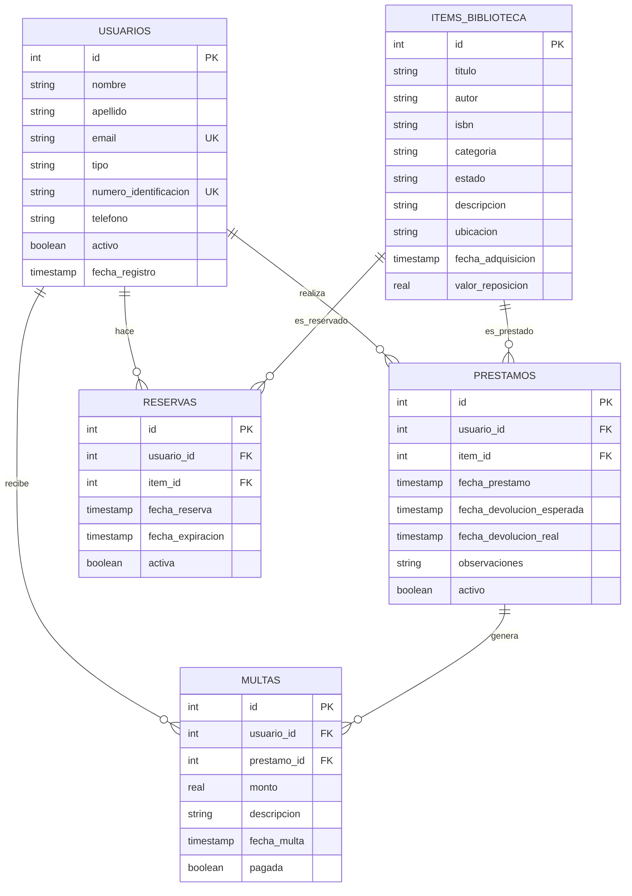

# Diagrama Entidad-Relación - Sistema Biblioteca Liskov

## Descripción General

Este diagrama representa la estructura de la base de datos del Sistema de Gestión de Biblioteca Liskov, mostrando las entidades principales, sus atributos y las relaciones entre ellas.

## Entidades Principales

### 1. **Usuarios**
- Gestiona la información de todos los tipos de usuarios del sistema
- Tipos: Alumno, Docente, Bibliotecario
- Campos únicos: email, numero_identificacion

### 2. **Items de Biblioteca**
- Representa todos los materiales disponibles en la biblioteca
- Categorías múltiples: libros, revistas, juegos, material didáctico, multimedia
- Estados: disponible, prestado, en reparación, perdido

### 3. **Préstamos**
- Registra las transacciones de préstamo de items
- Controla fechas de préstamo y devolución
- Manejo de estado activo/inactivo

### 4. **Reservas**
- Sistema de reservas para items no disponibles
- Control de expiración automática
- Estado activa/inactiva

### 5. **Multas**
- Gestión de penalizaciones por retrasos o daños
- Vinculación con préstamos específicos
- Control de pagos

## Relaciones

- **Usuario** → **Préstamo** (1:N): Un usuario puede tener múltiples préstamos
- **Item** → **Préstamo** (1:N): Un item puede ser prestado múltiples veces (históricamente)
- **Usuario** → **Reserva** (1:N): Un usuario puede tener múltiples reservas
- **Item** → **Reserva** (1:N): Un item puede ser reservado múltiples veces
- **Usuario** → **Multa** (1:N): Un usuario puede tener múltiples multas
- **Préstamo** → **Multa** (1:N): Un préstamo puede generar múltiples multas

## Diagrama Mermaid

## Índices de Base de Datos

Para optimizar el rendimiento, se han creado los siguientes índices:

- `idx_usuarios_email` - Búsqueda rápida por email
- `idx_items_titulo` - Búsqueda por título
- `idx_items_autor` - Búsqueda por autor
- `idx_prestamos_usuario` - Consultas por usuario
- `idx_prestamos_item` - Consultas por item
- `idx_reservas_usuario` - Reservas por usuario
- `idx_multas_usuario` - Multas por usuario

## Características Especiales

### Integridad Referencial
- Todas las relaciones FK están protegidas por constraints
- Eliminación en cascada controlada para mantener integridad histórica

### Timestamps Automáticos
- Campos de fecha se auto-popolanan con CURRENT_TIMESTAMP
- Permite auditoría completa de operaciones

### Campos de Estado
- Soft delete mediante campos `activo`/`activa`
- Permite mantener historial completo sin pérdida de datos

### Flexibilidad de Categorías
- Sistema de enums extensible
- Fácil adición de nuevos tipos sin cambios estructurales

## Validaciones a Nivel de Base de Datos

- **UNIQUE CONSTRAINTS**: email y numero_identificacion únicos
- **NOT NULL**: Campos críticos obligatorios
- **DEFAULT VALUES**: Valores predeterminados para nuevos registros
- **FOREIGN KEYS**: Integridad referencial garantizada